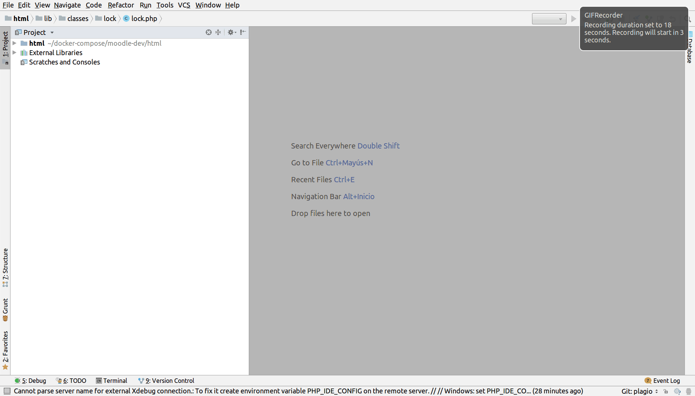

# docker-compose-moodle
[](https://travis-ci.org/jobcespedes/docker-compose-moodle)


[](https://www.buymeacoffee.com/jobcespedes)
[](LICENSE)

>Leer en [**Español**](#español)

This project quickly builds a local workspace for Moodle  (Apache2, PHP-FPM with XDEBUG y Postgres) using containers for each of its main components. The local workspace is built and managed by Docker Compose

## Quickstart:
1. Install Docker. Check out how to install [Docker](https://docs.docker.com/install/)
2. Install Docker Compose. Check out how to install [Docker Compose](https://docs.docker.com/compose/install/)
3. Download this repo: `git clone https://github.com/jobcespedes/docker-compose-moodle.git && cd docker-compose-moodle`
4. Clone Moodle repo: `git clone --branch MOODLE_35_STABLE --depth 1 git://github.com/moodle/moodle html`
5. Run with: `docker-compose up -d`

## Contents
1. [Environment Variables](#Environment-variables)
2. [Docker Compose Resources](#Docker-Compose-resources)
3. [Workspace Operations](#Project-management-with-Docker-Compose)
4. [Debugging with XDEBUG](#XDEBUG)
5. [Moodle Cron Debugging](#Cron-debugging)
6. [Database management with Pgadmin4](#Pgadmin4)
7. [Backup and restore database](#Backup-and-restore-database)
8. [Install Docker](https://docs.docker.com/install/)
9. [Install Docker Compose](https://docs.docker.com/compose/install/)

## Environment variables
The following table describes environment variables set in [**.env**](.env). The defaults work for a initial setup. They can be modified if needed.

| Variable | Default value | Use |
| :--- |:--- |:--- |
| **REPO_FOLDER** | html | Default relative path for Moodle repo |
| **DOCUMENT_ROOT** | /var/www/html | Mount point inside containers for volume **REPO_FOLDER** |
| **MY_TZ** | America/Costa_Rica | Containers timezone |
| **PG_LOCALE** | es_CR | Containers locale |
| **PG_PORT** | 5432 | Postregres port to expose  |
| **POSTGRES_DB** | moodle | Postgres DB for Moodle |
| **POSTGRES_USER** | user | DB user for Moodle |
| **POSTGRES_PASSWORD** | password | DB password for Moodle |
| **PHP_SOCKET** | 9000 | PHP-FPM socket to connect apache2  and php-fpm services |
| **ALIAS_DOMAIN** | localhost | Domain Alias |
| **WWW_PORT** | 80 | Web port to be bound |
| **MOODLE_DATA** | /var/moodledata | Mount point inside containers for Moodle data folder  |
| **WWWROOT** | localhost | Host part to set in Moodle file 'config.php' for config option 'wwwroot' |

## Docker Compose resources
The following table sums up Docker Compose resources.

| Component | Type | Responsability | Content | Config |
| :--- |:--- | :--- | :---| :---|
| **apache2** | Container | Web server | Debian9, Apache2 | [Apache2](http://dockerfile.readthedocs.io/en/latest/content/DockerImages/dockerfiles/php-apache.html#web-environment-variables) server and [modules for Moodle](https://docs.moodle.org/35/en/Apache) |
| **cron** | Container | Cron task for Moodle | Debian9, Cron | [Moodle cron task](https://docs.moodle.org/35/en/Cron) and its frequency |
| **php-fpm** | Container | Process manager for PHP | Debian9, PHP-FPM, XDEBUG | PHP, its modules and Moodle dependencies |
| **postgres** | Container | DBMS  | Debian9, Postgres | [User and DB](https://hub.docker.com/_/postgres/) |
| **db_dumps** | Volume | Restore db when built | Dump files for DB to restore | To restore an initial database if you start the container with a data directory that is empty. File name should be "dump-init.dump" |
| **moodledata** | Volume | Moodle data store | Data generated by moodle | [Moodle data dir ](https://docs.moodle.org/35/en/Installing_Moodle#Create_the_.28moodledata.29_data_directory) |
| ***REPO_FOLDER*** | Volume | Moodle code  | Moodle code  | It is set to 'html/' by deafult (check out [**.env**](.env)) |

## Project management with Docker Compose
> **Inside project folder**
1. Run project
``` bash
docker-compose up -d
# Different project name
# docker-compose -p my-proj up -d
```
2. Stop project
``` bash
docker-compose stop
# docker-compose stop php-fpm
```
3. Start project
``` bash
docker-compose start
# docker-compose start php-fpm
```
4. Remove project
``` bash
docker-compose down
# Remove volumes too
# docker-compose --volumes
# With different project name:
# docker-compose -p my-proj down
```
5. Logs
``` bash
docker-compose logs
# docker-compose logs -f --tail="20" php-fpm
```

## XDEBUG
> Use idekey `PHPTEST`

#### PHPStorm
Debug config for IDE PHPStorm:

1. Add server:
    * Settings -> Languages -> PHP -> Servers
    * Name: localhost
    * Host: localhost
    * Port: 80
    * Debugger: Xdebug
    * Use path mapping: checked
    * Absolute path on the server: /var/www/html



2. Add PHP remote debug
    * Run / Debug Configurations -> PHP remote debug
    * Use server created in step #1 and set idekey `PHPTEST`


3. Enable `Start listening for PHP Debug Connections` 

### Cron debugging
Follow previous steps, set a breakpoint and then run:
```bash
docker-compose exec php-fpm php admin/cli/cron.php
```
There is a scrip for [Specific cron tasks](https://docs.moodle.org/35/en/Administration_via_command_line). For example:
```bash
docker-compose exec php-fpm php admin/tool/task/cli/schedule_task.php --execute='\core\task\cache_cleanup_task'
# Listing tasks
# docker-compose exec php-fpm php admin/tool/task/cli/schedule_task.php --list
```

## Pgadmin4
Config pgadmin4
1. Go to http://localhost:5050
2. In ```File -> Preferences -> Binary paths``` set ```/usr/bin```
3. Add new server:
    * Tab ```General```
        * Name: Any name you want
    * Tab ```Connection```
        * Host name/address: ```postgres```
        * Host Username: ```user```
        * Host Password: ```password```
    * Save

## Backup and restore database
When needed, backup and restore of the database could be done in the following way.
```bash
# Set env vars
POSTGRES_USER=user
POSTGRES_DB=moodle
DB_DUMP_NAME=dump-init.$(date +"%Y%m%d%H%M%S").dump

# Backup
# -Fc  Output a custom-format archive suitable for input into pg_restore
docker-compose exec postgres pg_dump -U ${POSTGRES_USER} ${POSTGRES_DB} -Fc -f /opt/db_dumps/${DB_DUMP_NAME}

# Restore
# -c  Clean (drop) database objects before recreating them.
# -C  Create the database before restoring into it
docker-compose exec postgres pg_restore -U ${POSTGRES_USER} -d postgres -c -C -O --role ${POSTGRES_USER} /opt/db_dumps/${DB_DUMP_NAME}
```

A database can be automatically restored when postgres service starts. By placing a dump file inside 'db_dumps' folder and naming it "dump-init.dump", postgres container will try to restore that file as an initial database if data directory is empty.
> **IMPORTANT**: Depending of  size, database initial availability could be delayed

# Español
Este es un repositorio para crear rápidamente un entorno de trabajo con Moodle (Apache2, PHP-FPM con XDEBUG y Postgres) usando contenedores para cada uno sus principales componentes. El entorno de trabajo se crea y gestiona con Docker Compose.

## Pasos rápidos para crear proyecto:
1. Tener Docker. Ver como instalar [Docker](https://docs.docker.com/install/)
2. Tener Docker Compose. Ver como instalar [Docker Compose](https://docs.docker.com/compose/install/)
3. Descargar este repo y acceder a él: ```git clone https://github.com/jobcespedes/docker-compose-moodle.git && cd docker-compose-moodle```
4. Copiar repositorio de código de Moodle: ```git clone --branch MOODLE_35_STABLE --depth 1 git://github.com/moodle/moodle html```
5. Desplegar con: ```docker-compose up -d```

## Variables de ambiente
La siguiente tabla contiene las variables utilizadas en el archivo [**.env**](.env) para Docker Compose. Los valores por defecto funcionan para una configuración inicial. Cámbielos de ser necesario.

| Variable | Valor por defecto | Utilidad |
| :--- |:--- |:--- |
| **REPO_FOLDER** | html | Ruta relativa para el código de Moodle |
| **DOCUMENT_ROOT** | /var/www/html | Punto de montaje para **REPO_FOLDER** dentro de contenedores |
| **MY_TZ** | America/Costa_Rica | Zona horaria para los contenedores |
| **PG_LOCALE** | es_CR | Configuración de lugar |
| **PG_PORT** | 5432 | Puerto de base de datos postgres a publicar  |
| **POSTGRES_DB** | moodle | Nombre de la base de datos postgres de Moodle |
| **POSTGRES_USER** | user | Nombre de usuario de la base de datos postgres de Moodle |
| **POSTGRES_PASSWORD** | password | Contraseña de la base de datos postgres de Moodle |
| **PHP_SOCKET** | 9000 | Socket para conectar apache2 con php-fpm |
| **ALIAS_DOMAIN** | localhost | Alias del Dominio |
| **WWW_PORT** | 80 | Puerto web a publicar |
| **MOODLE_DATA** | /var/moodledata | Carpeta de datos de Moodle a montar en los contenedores |
| **WWWROOT** | localhost | Para de nombre de host en la url de config.php de Moodle |

## Estructura de Docker Compose
A continuación se incluye una tabla que resume la estructura del archivo de Docker Compose:

| Componente | Tipo | Responsabilidad | Contenido | Configuración |
| :--- |:--- | :--- | :---| :---|
| **apache2** | Contenedor | Servidor web | Debian9, Apache2 | El mínimo de módulos de [Apache2](http://dockerfile.readthedocs.io/en/latest/content/DockerImages/dockerfiles/php-apache.html#web-environment-variables) |
| **cron** | Contenedor|Tarea de cron de Moodle | Debian9, Cron | Frecuencia de ejecución de tarea [cron de Moodle](https://docs.moodle.org/35/es/Cron) |
| **php-fpm** | Contenedor | Interprete y manejador de procesos para PHP | Debian9, PHP-FPM, XDEBUG | Modulos de php y paquetes adicionales para Moodle  |
| **postgres** | Contenedor | Gestor de base de datos  | Debian9, Postgres | [Usuario y base de datos](https://hub.docker.com/_/postgres/) |
| **db_dumps** | Volumen | Restaurar una base de datos inicial | Archivos de respaldo de base de datos. | Para restaurar al iniciar si se comienza con directorio de datos vacío. El nombre del archivo de respaldo a utilizar debe ser "dump-init.dump" |
| **moodledata** | Volumen | Almacén de datos de Moodle | Archivos generados por Moodle | [Moodle data dir ](https://docs.moodle.org/all/es/Gu%C3%ADa_r%C3%A1pida_de_Instalaci%C3%B3n#Crea_el_directorio_de_datos) |
| ***REPO_FOLDER*** | Volumen | Código de aplicación  | Código de Moodle  | Por defecto es './html' (ver archivo .env) |

## Gestión del proyecto con Docker Compose
> **Dentro de la carpeta del proyecto**
1. Correr proyecto
``` bash
docker-compose up -d
# Nombrar el proyecto diferente a la carpeta:
# docker-compose -p mi-proy up -d
```
2. Detener el proyecto
``` bash
docker-compose stop
# docker-compose stop php-fpm
```
3. Iniciar el proyecto
``` bash
docker-compose start
# docker-compose start php-fpm
```
4. Eliminar proyecto
``` bash
docker-compose down
# Eliminar los volumenes también:
# docker-compose --volumes
# Eliminar con un nombre de proyecto especifico:
# docker-compose -p mi-proy down
```
5. Logs
``` bash
docker-compose logs
# docker-compose logs -f --tail="20" php-fpm
```

### XDEBUG
> Se utiliza el idekey `PHPTEST`

#### PHPStorm
Configuración para depurar con IDE PHPStorm:

1. Agregar server:
    * Settings -> Languages -> PHP -> Servers
    * Name: localhost
    * Host: localhost
    * Port: 80
    * Debugger: Xdebug
    * Use path mapping: checked
    * Absolute path on the server: /var/www/html


2. Agregar PHP remote debug
    * Run / Debug Configurations -> PHP remote debug
    * Use server created in step #1 and set idekey `PHPTEST`


3. Activar botón `Start listening for PHP Debug Connections` 

### Depurar tareas de cron
Siga los pasos anteriores, establezca una interrupción y ejecuta en el la línea de comandos:
```bash
docker-compose exec php-fpm php admin/cli/cron.php
```
Se pueden ejecutar también [tareas específicas de cron](https://docs.moodle.org/all/es/Administraci%C3%B3n_por_l%C3%ADnea_de_comando#Trabajos_agendados)Por ejemplo:
```bash
docker-compose exec php-fpm php admin/tool/task/cli/schedule_task.php --execute='\core\task\cache_cleanup_task'
# Listar tareas
# docker-compose exec php-fpm php admin/tool/task/cli/schedule_task.php --list
```

### Pgadmin4
Pasos para usar pgadmin4
1. Ingresar a http://localhost:5050
2. En ```File -> Preferences -> Binary paths``` establecer en ```/usr/bin```
3. Agregar nuevo servidor:
    * Pestaña ```General```
        * Name: Un nombre para el servidor
    * Pestaña ```Connection```
        * Host name/address: ```postgres```
        * Host Username: ```user```
        * Host Password: ```password```
    * Guardar

## Respaldar y restaurar la base de datos
Es posible respaldar y restaurar la base de datos de la siguiente manera.
```bash
# Establecer vars de entorno
POSTGRES_USER=user
POSTGRES_DB=moodle
DB_DUMP_NAME=dump-init.$(date +"%Y%m%d%H%M%S").dump

# Respaldar
# -Fc  Formato personalizado para pg_restore
docker-compose exec postgres pg_dump -U ${POSTGRES_USER} ${POSTGRES_DB} -Fc -f /opt/db_dumps/${DB_DUMP_NAME}

# Restaurar
# -c  Limpia los objetos de la base de datos antes de recrearlos
# -C  Crea la base de datos antes de restaurarla
docker-compose exec postgres pg_restore -U ${POSTGRES_USER} -d postgres -c -C -O --role ${POSTGRES_USER} /opt/db_dumps/${DB_DUMP_NAME}
```

Se puede restaurar una base de datos, usando pg_dump (formato personalizado de Posgres), a la caperta 'db_dumps' y nombrando el archivo como dump-init.dump
> **IMPORTANTE**: Dependiendo del tamaño, la ejecución de este sql podría demorar la disponibilidad inicial de la base de datos.
